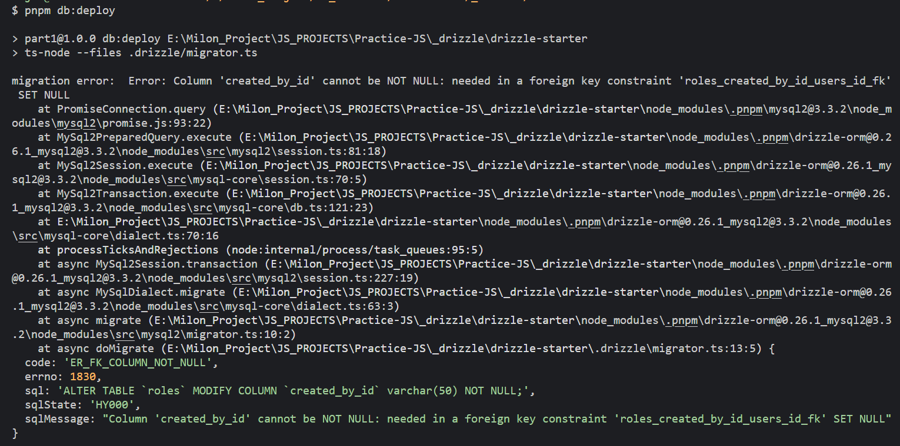

## how to reproduce the error

```bash
# clone the repo
# install deps
pnpm i
# modify db connection url in .drizzle/migrator.ts file
# apply migrations to db
pnpm db:deploy # you will get the error

#------------------

# if you want to generate the migration again
- step 1: delete .drizzle/migrations folder
- step 2: remove  .notNull() from RoleSchema createdById in role.schema.ts file
- step 3: generate first migration
- step 4: add nonNull() again and generate 2nd migration.
- step 5: apply the migration again you will got the error
```

## error

> we have this cratedById as nullable **0000_lush_captain_cross.sql**

```ts
createdById: varchar("created_by_id", { length: 50 }).references(() => UserSchema.id, {
    onDelete: "set null",
    onUpdate: "cascade",
  }),

```

> then i made it non nullable and generate a migrations **0001_aspiring_marten_broadcloak.sql**

```ts
  createdById: varchar("created_by_id", { length: 50 })
    .notNull()
    .references(() => UserSchema.id, {
      onDelete: "set null",
      onUpdate: "cascade",
    }),
```

> then run all the migrations got this error? migrator tool suppose to handle this right? isn't it a bug?



## Answer:

we made the field non nullable, but on Delete we try to put set null, that's why got the error
