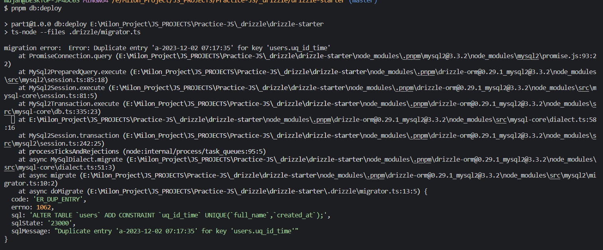

## Error Statement

- if any migration file have multiple line of statement, and if 3rd line cause any error to failed the migration then changes made by 1st and 2nd line on the database did not rollback. so next time when i try to fix the issue of 3rd line and rerun the migration got error on 1st and 2nd line that those are already applied.

## how to reproduce the error

```bash
# clone the repo
# install deps
pnpm i
# modify db connection url in .drizzle/migrator.ts file and src/db/db.ts
# apply migrations to db
pnpm db:generate
pnpm db:deploy # base setup done
pnpm db:seed # it will create two row in user table with same full_name and created_at date, based on that we will get the error

```

# now we will make some changes on the user schema to get error on drizzle kit deploy

### updated schema (added gender and unique constraint)

```ts

export const UserSchema = mysqlTable(
  "users",
  {
    id: varchar("id", { length: 50 }).primaryKey(),
    fullName: varchar("full_name", { length: 100 }).notNull(),
    gender: mysqlEnum("gender", ["male", "female"]).notNull().default("male"), // added new
    createdAt: datetime("created_at", { mode: "date" })
      .default(sql`CURRENT_TIMESTAMP`)
      .notNull(),
  }
  (table) => {
    return {
      uq_id_time: unique("uq_id_time").on(table.fullName, table.createdAt), // added new
    };
  }
);
```

### generated migrations

```bash
pnpm db:generate
```

### migration file we got:

```sql
 ALTER TABLE `users` ADD CONSTRAINT `uq_id_time` UNIQUE(`full_name`,`created_at`);--> statement-breakpoint
 ALTER TABLE `users` ADD `gender` enum('male','female') DEFAULT 'male' NOT NULL;

-- just change the order of statement to have the error in 2nd line
-- updated order

 ALTER TABLE `users` ADD `gender` enum('male','female') DEFAULT 'male' NOT NULL;--> statement-breakpoint
 ALTER TABLE `users` ADD CONSTRAINT `uq_id_time` UNIQUE(`full_name`,`created_at`);
```

### Try to deploy those changes

```bash
pnpm db:deploy
```



### it failed but if you see the user table on db now we can see there are gender field is there. which should not be there
